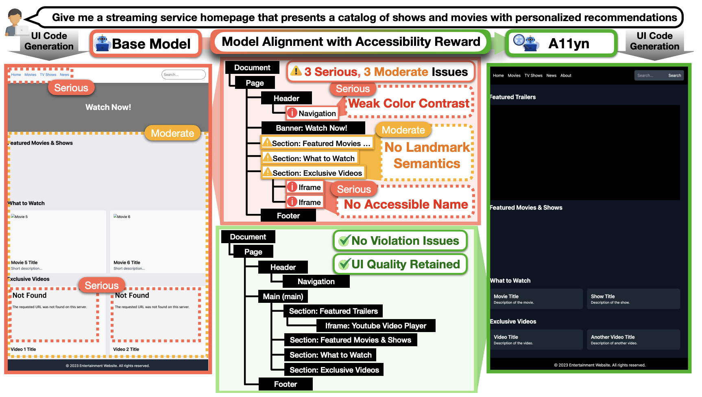
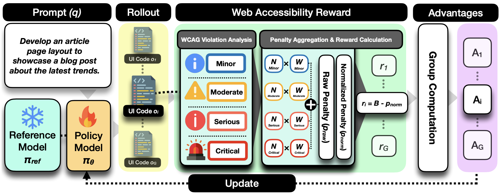

# A11yn: Aligning LLMs for Web Accessibility-Aware UI Generation (COLM 2026)

This is the official repository for our COLM 2026 paper **"A11yn: Aligning LLMs for Web Accessibility-Aware UI Generation."** In this work, we introduce A11yn (pronounced *align*), a post-training framework that aligns code-generating LLMs to produce web UIs with fewer WCAG violations in a single generation pass.

We release our training pipeline, Web Accessibility reward, and the UIReq-6.8K and RealUIReq-300 datasets in this repository.

## News

- **2026:** Our paper was accepted to the Conference on Language Modeling (COLM 2026).

## Overview

Web UI generation models can produce visually coherent interfaces from natural-language requests, but their outputs often contain WCAG violations such as weak color contrast, missing accessible names, and incorrect landmark semantics. We introduce A11yn to make accessibility part of the model's generation behavior rather than a post-hoc correction step.

We start from Qwen2.5-Coder-7B-Instruct and train it on UIReq-6.8K. During training, the model generates multiple UI candidates for each request, renders them in a browser, and receives feedback from an automated WCAG audit. We convert this feedback into a verifiable reward and optimize the model with GRPO. Once aligned, A11yn generates accessibility-aware web UIs in a single pass while retaining comparable semantic and visual quality. We evaluate this behavior on RealUIReq-300 using two independent accessibility auditors.



*A11yn aligns a base model with an accessibility reward, reducing WCAG violations while retaining UI quality.*

## Highlights

- **Single-pass generation:** We align the model during post-training rather than relying on iterative repair.
- **Auditor-guided reward:** We convert Axe-core violations into an automatic, severity-aware training signal.
- **Size-aware optimization:** We normalize by DOM size to reduce reward hacking through overly simple interfaces.
- **Two released datasets:** We provide 6,800 training instructions and 300 realistic evaluation requests.

## Method

For each prompt, the policy model samples a group of UI-code rollouts. We render every candidate, audit it with Axe-core, and aggregate affected DOM nodes using severity-aware penalties. We then normalize the penalty by DOM size, compute relative advantages within the rollout group, and update the policy with GRPO. This online auditor-guided loop provides training feedback without requiring densely annotated accessibility labels.



*Our training pipeline converts WCAG audit results into relative advantages for GRPO updates.*

## Data

| Dataset | Split | Description | File |
| --- | ---: | --- | --- |
| UIReq-6.8K | 6,800 | Diverse, instruction-only web UI requests spanning 68 application categories | [`data/UIReq6.8K/uireq6800.json`](data/UIReq6.8K/uireq6800.json) |
| RealUIReq-300 | 300 | Human-refined, real-page-grounded requests for accessibility and UI-quality evaluation | [`data/RealUIReq300/realuirequest300.json`](data/RealUIReq300/realuirequest300.json) |

We use UIReq-6.8K for training and RealUIReq-300 as the primary evaluation benchmark in our paper.

## Setup

Our training stack requires Linux, CUDA-capable NVIDIA GPUs, and a recent Python 3 environment. We trained the model on four NVIDIA RTX PRO 6000 Blackwell GPUs with 96 GB VRAM each.

```bash
git clone https://github.com/jeffrobot/A11yn.git
cd A11yn

python3 -m venv .venv
source .venv/bin/activate
python -m pip install --upgrade pip
python -m pip install -r requirements.txt
playwright install chromium
```

Weights & Biases logging is enabled by default. Authenticate with `wandb login`, or set `WANDB_MODE=offline`. Set `HUGGINGFACE_TOKEN` or `HF_TOKEN` if your model access requires authentication.

## Training

To reproduce our paper-scale four-GPU configuration:

```bash
GPU_IDS=0,1,2,3 \
VLLM_GPU_MEMORY_UTILIZATION=0.60 \
bash a11yn_train.sh
```

Our launcher defaults to `Qwen/Qwen2.5-Coder-7B-Instruct`, UIReq-6.8K, four GPUs, eight generations per prompt, and output under `outputs/a11yn`.

Common overrides:

```bash
GPU_IDS=0,1 \
MODEL_NAME_OR_PATH=Qwen/Qwen2.5-Coder-7B-Instruct \
DATASET_NAME=data/UIReq6.8K/uireq6800.json \
OUTPUT_DIR=outputs/a11yn \
bash a11yn_train.sh
```

The effective training batch size must be divisible by `NUM_GENERATIONS`; the launcher checks this before training. Resume an interrupted run with `RESUME_FROM_CHECKPOINT=/path/to/checkpoint`.

The accessibility reward renders generated HTML in headless Chromium. External network requests are blocked by default, and the vendored Tailwind stylesheet is served locally. Keep `A11YN_BLOCK_EXTERNAL_REQUESTS=1` when evaluating untrusted model output.

## Main Results

We report the following results on RealUIReq-300. Lower is better except for Lighthouse.

| Model | Weighted Violation Score | Lighthouse | IR (Axe) | IR (AChecker) |
| --- | ---: | ---: | ---: | ---: |
| Qwen2.5-Coder-7B-Instruct | 4,479 | 90.88 | 0.40 | 0.62 |
| **A11yn** | **662** | **97.68** | **0.05** | **0.26** |

Compared with the base model, our A11yn model reduces the Axe inaccessibility rate by **87.5%** and the independently measured AChecker rate by **58.1%**, while preserving comparable semantic and visual quality.

## Repository Structure

```text
A11yn_train.py            GRPO training entry point
accessibility_reward.py  Axe-core reward and HTML evaluation
a11yn_train.sh           Reproducible distributed launcher
deepspeed_zero3.yaml     Accelerate/DeepSpeed configuration
data/                    UIReq-6.8K and RealUIReq-300
assets/                  Overview and method figures
axe.min.js               Vendored Axe-core runtime
vendor/                  Vendored Tailwind stylesheet
```
